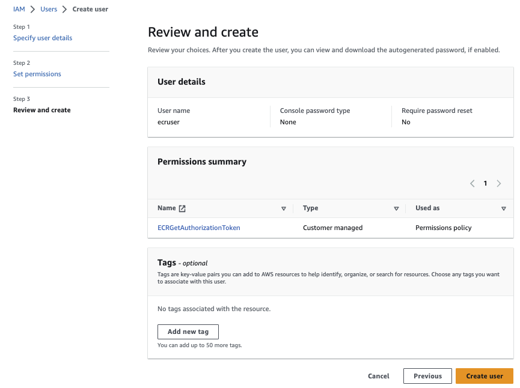

# Access AWS service from a k8s cluster running over the internet

## Problems

We want to access a remote AWS service like ECR to get an image scheduled to a Kubernetes cluster running in another cloud. The problem is how to access to the docker image persisted in private ECR registry so the pod can be created:


The second challenge is how to access any AWS service, like S3, from pods running on remote Kubernetes running on another cloud provider. 

All communications are over public internet.

## Demonstration preparation

As a pre-requisite you can build a docker image from the [simple python program]() that will be deploy on your Kubernetes cluster and it will list the S3 buckets in your account. The code source is in the `src` folder. 

You can prepare for the demonstration using a set of elements from this repository but see the next sectons for more details:

* We assume you have aws CLI and you configured your access to AWS. You should set the temporary access token, access key id and access key secret in environment variables

  ```sh
  export AWS_ACCESS_KEY_ID=AS....EM
  export AWS_SECRET_ACCESS_KEY=fE.....lN
  export AWS_SESSION_TOKEN=IQoJ......v02SJ
  ```

* Run CDK to create IAM user, Policy, ECR repository. for that use the script and custom image:

  ```sh
  # under cdk folder
  ./startPythonAWSEnv.sh
  # Verify you can see your buckets
  aws s3 ls
  # in the shell use cdk CLI
  cdk deploy
  ```

  This should generate a CloudFormation template named `EcrAccessSample` and then the resources in IAM and ECR, matching the description in next section.

* Build the image with the name of the ECR repository: (change `your_aws_account_id` below)

  ```sh
  cd src
  docker build -t your_aws_account_id.dkr.ecr.us-west-2.amazonaws.com/jbcodeforce/s3bucketlist .
  ```

* Login to docker: (change `your_aws_account_id` below)

  ```sh
  aws ecr get-login-password --region us-west-2 | docker login --username AWS --password-stdin  your_aws_account_id.dkr.ecr.us-west-2.amazonaws.com

  ```

* Push the image that we will use later to test kubernetes to S3 connection: (change `your_aws_account_id` below)

  ```sh
  docker push your_aws_account_id.dkr.ecr.us-west-2.amazonaws.com/jbcodeforce/s3bucketlist
  ```


## ECR remote access

Recall that ECR has the following components: A registry that is private and unique to an account, and then repositories to include a set of OCI (Open Container Initiative) images with different version.


Any client must authenticate to Amazon ECR private registries as an AWS user before it can push and pull images. Access control policies must be defined to grant access to private repositories via API.

Amazon ECR provides several managed policies to control user access. It uses resource-based permissions.

Amazon ECR repository policies and IAM policies are used when determining which actions a specific user or role may perform on a repository.

Any users must permission to make calls to the `ecr:GetAuthorizationToken` API through an IAM policy before they can authenticate to a registry and push or pull any images from any Amazon ECR repository. 

So create a IAM Policy:

```json
{
    "Version": "2012-10-17",
    "Statement": [
        {
            "Sid": "ecrauthorization",
            "Effect": "Allow",
            "Action": "ecr:GetAuthorizationToken",
            "Resource": "*"
        }
    ]
}
```

Finally be sure to authorize pull action on the image repository you want the user to access (see next session for repository policy).

### ECR access using IAM user

Using AWS CLI, Docker and AWS account, we can download a container image from our private registry. The following diagram illustrates what we can do:


A developer or CI/CD pipeline can push image to the registry/repository using the docker CLI, but he/she needs to be authenticated. An authentication token is used to access any Amazon ECR registry that your IAM principal has access to and is valid for 12 hours. 

1. Create a IAM user: `ecruser` and attach the ECR policy created above to it:

    

    We can add an access key to the created user, so we can test the next steps with AWS CLI.

1. Get the authorization token

    An authorization token represents the IAM authentication credentials and can be used to access any Amazon ECR registry that our IAM principal has access to. The authorization token is valid for 12 hours. To obtain an authorization token, we must use the `GetAuthorizationToken` API operation to retrieve a base64-encoded authorization token containing the username AWS and an encoded password.

    The AWS CLI provides a `get-login-password` command to simplify this authentication process. This command returns a temporary access token. 

    Here is an example to use a logged admin user (who create the ECR registry):

    ```sh
    # use a specific IAM user: like ecruser using the access key and secret
    aws configure 
    aws ecr get-login-password --region us-west-2 | docker login --username AWS --password-stdin your_aws_account_id.dkr.ecr.us-west-2.amazonaws.com
    # The following command should fail
    docker pull <accountID>.dkr.ecr.us-west-2.amazonaws.com/jbcodeforce/s3bucketlist
    # with error like
    # denied: User: arn:aws:iam::403993201276:user/ecruser is not authorized to perform: ecr:BatchGetImage on resource...
    ```

1. Be sure to have one ECR repository policy to authorize the `ecruser` user to pull the expected image. This may be done in the ECR AWS console, repositories view, and add permissions to one of the repository:

    ```json
    {
    "Version": "2012-10-17",
    "Statement": [
        {
        "Sid": "new statement",
        "Effect": "Allow",
        "Principal": {
            "AWS": "arn:aws:iam::4....:user/ecruser"
        },
        "Action": [
            "ecr:BatchCheckLayerAvailability",
            "ecr:BatchGetImage",
            "ecr:GetDownloadUrlForLayer",
            "ecr:ListImages"
        ]
        }
    ]
    }
    ```

    [See policy examples in the product documentation](https://docs.aws.amazon.com/AmazonECR/latest/userguide/repository-policy-examples.html).

1. Pull image

    ```sh
     docker pull <accountID>.dkr.ecr.us-west-2.amazonaws.com/jbcodeforce/autonomous-car-ride
     ```

### ECR access with code

To make HTTPS call to AWS services, we need to get temporary security credentials from the AWS Security Token Service (AWS STS).

* Example of calling ECR API to get the list of tags for a repository, using a temporary authorization token:

```sh
TOKEN=$(aws ecr get-authorization-token --output text --query 'authorizationData[].authorizationToken') 
curl -i -H "Authorization: Basic $TOKEN" https://<myaccountID>.dkr.ecr.us-west-2.amazonaws.com/v2/jbcodeforce/java-lambda/tags/list
```

* There is no API to pull an image.


### ECR access from remote Kubernetes

To access a remote registry, Kubernetes cluster uses the Secret of `kubernetes.io/dockerconfigjson` type to authenticate to it and to pull a private image. The secret can be define in a specific namespace. The `.dockerconfigjson` is the base64 encrypted version of the docker `config.json` file:

```json
{
	"auths": {
		"40.....dkr.ecr.us-west-2.amazonaws.com": {},
		"https://index.docker.io/v1/": {}
	}

```
* command to encrypt the docker config file.

```sh
cat ~/.docker/config.json| base64
```

Here is the secret:

```yaml
apiVersion: v1
kind: Secret
metadata:
  name: ecrregistrykey
  namespace: yourspecialns
data:
  .dockerconfigjson: Um....
type: kubernetes.io/dockerconfigjson
```

* A better solution is to use kubectl, combined with Temporary Token:

```sh
export REGISTRY_SERVER=https://403.....dkr.ecr.us-west-2.amazonaws.com
export TOKEN=$(aws ecr get-authorization-token --output text --query 'authorizationData[].authorizationToken') 
export EMAIL=youremail
kubectl create secret docker-registry awsecr --docker-server=$REGISTRY_SERVER --docker-username=AWS --docker-password=$TOKEN --docker-email=$EMAIL
```

The secret will work for 12 hours. If the security requirements do not enforce changing often then use the IAM user and access key to create the secret:

```sh
export PWD=secertkeyofiamuser
export EMAIL=youremail
kubectl create secret docker-registry awsecr --docker-server=$REGISTRY_SERVER --docker-username=ecruser --docker-password=$PWD--docker-email=$EMAIL
```

* Verify it

```sh
kubectl describe secret awsecr
Name:         awsecr
Namespace:    default
Labels:       <none>
Annotations:  <none>

Type:  kubernetes.io/dockerconfigjson

Data
====
.dockerconfigjson:  298 bytes
```

See [Kubernetes documentation](https://kubernetes.io/docs/tasks/configure-pod-container/pull-image-private-registry/).

Once done define a deployment.yaml or a pod.yaml file with the image name referencing the full path to the ECR private registry.

```yaml
apiVersion: v1
kind: Pod
metadata:
  name: tenant
spec:
  containers:
  - name: private-reg-container
    image: 403993201276.dkr.ecr.us-west-2.amazonaws.com/jbcodeforce/demo-saas-tenant-mgr:latest
  imagePullSecrets:
  - name: awsecr
```

Try these with [killercoda - kubernetes](https://killercoda.com/kubernetes).

## Other things to consider

* If we need to use image encryption then the public KMS key needs to be in the Kubernetes cluster to be able to decrypt the image.

## Access from pod to S3

This is the second example on how to access AWS resources from a running pod inside of a remote Kubernetes platform, not running on AWS.

The main approach is to use the [IAM Role Anywhere](https://docs.aws.amazon.com/rolesanywhere/latest/userguide/introduction.html) capability.