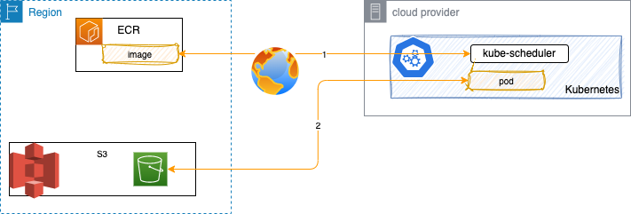
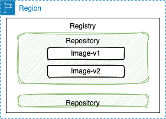
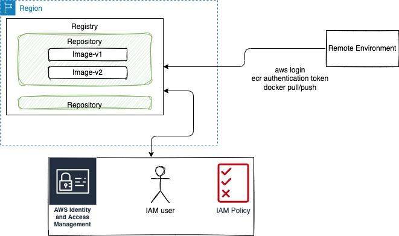

# Access AWS service from a k8s cluster running over the internet

## Problems

We want to access a remote AWS service like ECR to get an image scheduled to a Kubernetes cluster running in another cloud. The problem is how to access to the docker image persisted in private ECR registry so the pod can be created:



The second challenge is how to access any AWS service, like S3, from pods running on remote Kubernetes running on another cloud provider. 

All communications are vover public internet.

## ECR remote access

Recall that ECR has the following components: A registry that is private and unique to an account, and then repositories to include a set of OCI (Open Container Initiative) images with different version.



Any client must authenticate to Amazon ECR registries as an AWS user before it can push and pull images. Access control policies can be defined using repository policies.

A developer or CI/CD pipeline can push image to the registry/repository using the docker CLI, but he/she needs to be authenticated. The AWS CLI provides a `get-login-password` command to simplify the authentication process. 

Here is an example to use a logged user:

```sh
# use a specific IAM user
aws configure 
aws ecr get-login-password --region us-west-2 | docker login --username AWS --password-stdin your_aws_account_id.dkr.ecr.us-west-2.amazonaws.com
# then 
docker push amazonaws.com/jbcodeforce/autonomous-car-ride:latest
# or 
docker push
```

Code can also use AWS API.

### ECR access using IAM user

Amazon's Elastic Container Repository (ECR) allows you to push and pull images to a private repository inside your AWS account.
Using AWS CLI, Docker and AWS account we can download a container image from our private registry. The following diagram illustrates what we can do



1. Create a Policy

Allow the action to get an authorization token to access ECR registries.

```json
{
    "Version": "2012-10-17",
    "Statement": [
        {
            "Sid": "ecrauthorization",
            "Effect": "Allow",
            "Action": "ecr:GetAuthorizationToken",
            "Resource": "*"
        }
    ]
}
```

Retrieves an authorization token. An authorization token represents your IAM authentication credentials and can be used to access any Amazon ECR registry that your IAM principal has access to. The authorization token is valid for 12 hours.

### ECR access with code

### ECR access from remote Kubernetes

## Access from pod to S3
